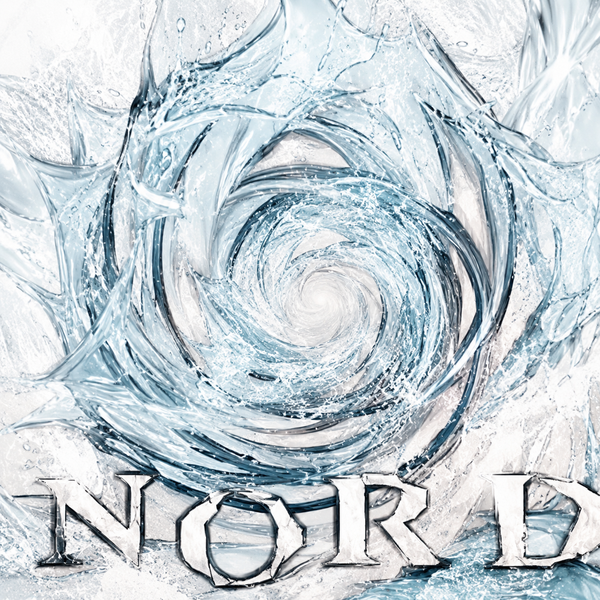

 

 

15+ years in IT · 4+ years in MLOps & AI Infra · St. Petersburg · Building infrastructure that does not wake people up at 3 AM

  

&nbsp;
&nbsp;
&nbsp;

 

**Daily**&nbsp;&nbsp;

**Infra**&nbsp;&nbsp;

**Cloud**&nbsp;&nbsp;

&nbsp;<b>full stack</b>&nbsp;—&nbsp;всё, что ломалось и чинилось

 

 

### 🛠️ Featured projects

| Project | What it does | Stars |
| --- | --- | --- |
| [`vpn-ikev2`](https://github.com/nordz0r/vpn-ikev2) | Automated StrongSwan IKEv2 + Let's Encrypt VPN installation — one script, working VPN. |  |
| [`skills`](https://github.com/nordz0r/skills) | Personal collection of AI agent skills. |  |
| [`proxy-vpn`](https://github.com/nordz0r/proxy-vpn) | HTTP/SOCKS5 proxy over Xray (VLESS + REALITY) in Docker, Amnezia compatible. |  |
| [`sysinfo`](https://github.com/nordz0r/sysinfo) | Linux system monitoring and telemetry utility. |  |
| [`nopaste`](https://github.com/nordz0r/nopaste) | Self-hosted paste service. |  |
| [`chatGPT`](https://github.com/nordz0r/chatGPT) | Telegram bot for OpenAI ChatGPT with dialog context persistence. |  |

 

<picture>
  <source media="(prefers-color-scheme: dark)" srcset="https://github-readme-stats-fast.vercel.app/api?username=nordz0r&show_icons=true&title_color=00E5FF&text_color=c9d1d9&icon_color=00E5FF&bg_color=00000000&hide_border=true&include_all_commits=true&rank_icon=github" />
  <source media="(prefers-color-scheme: light)" srcset="https://github-readme-stats-fast.vercel.app/api?username=nordz0r&show_icons=true&title_color=00E5FF&text_color=24292f&icon_color=00E5FF&bg_color=00000000&hide_border=true&include_all_commits=true&rank_icon=github" />
  
</picture>
&nbsp;&nbsp;
<picture>
  <source media="(prefers-color-scheme: dark)" srcset="https://github-readme-stats-fast.vercel.app/api/top-langs/?username=nordz0r&title_color=00E5FF&text_color=c9d1d9&bg_color=00000000&hide_border=true&layout=compact&langs_count=8" />
  <source media="(prefers-color-scheme: light)" srcset="https://github-readme-stats-fast.vercel.app/api/top-langs/?username=nordz0r&title_color=00E5FF&text_color=24292f&bg_color=00000000&hide_border=true&layout=compact&langs_count=8" />
  
</picture>

  

<picture>
  <source media="(prefers-color-scheme: dark)" srcset="https://streak-stats.demolab.com?user=nordz0r&hide_border=true&background=0d1117&ring=00E5FF&fire=00E5FF&currStreakLabel=00E5FF&sideLabels=c9d1d9&currStreakNum=c9d1d9&sideNums=c9d1d9&dates=6e7681" />
  <source media="(prefers-color-scheme: light)" srcset="https://streak-stats.demolab.com?user=nordz0r&hide_border=true&background=ffffff&ring=00E5FF&fire=00E5FF&currStreakLabel=00E5FF&sideLabels=24292f&currStreakNum=24292f&sideNums=24292f&dates=57606a" />
  
</picture>

 

<picture>
  <source media="(prefers-color-scheme: dark)" srcset="https://raw.githubusercontent.com/nordz0r/nordz0r/output/github-snake-dark.svg" />
  <source media="(prefers-color-scheme: light)" srcset="https://raw.githubusercontent.com/nordz0r/nordz0r/output/github-snake.svg" />
  
</picture>

 

infrastructure that does not wake people up at 3 AM — powered by automation, zero trust, and strong coffee

  

